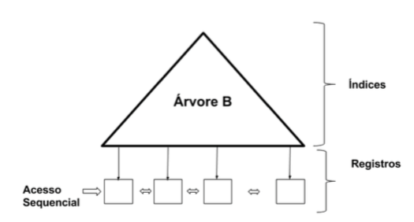
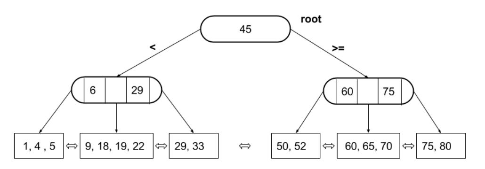
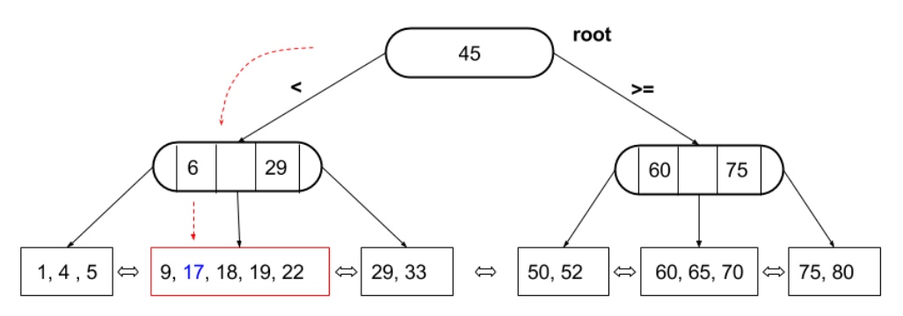
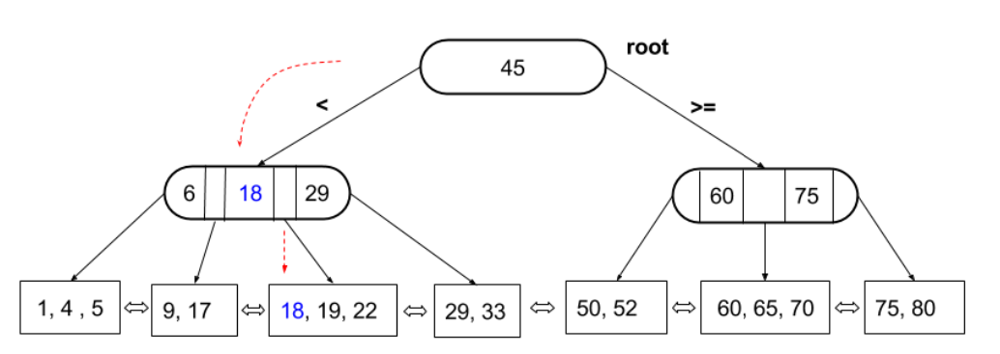

# Database with B+ tree

## Introduction

In computer science, a B-tree is a data structure designed to work especially on secondary memory like a magnetic disk or other secondary storage devices. Among its properties it allows the insertion, removal and search of keys in a logarithmic time complexity and, for this reason, it is widely used in applications that need to manipulate large amounts of information such as a database or a file management system.

If we analyze the B-trees, they are a generalization of the binary search trees, since each number of a binary tree stores a single search key, while the B-trees store a number greater than one of search keys in each node, or in the most usual term for that tree, in each page. As the main idea of ​​B trees and working with secondary memory devices, the less disk access the data structure provides, the better the system performance will be in the search operation on the manipulated data.

In a B+ tree, all records are stored at the last level. The levels above constitute an index composed only of keys, whose organization is equal to the organization of a B-tree. In this work, a B+ tree will be implemented that allows the insertion of new data, search of a given data in the database and to print the current tree.

The database to be implemented must be able to manage GBs of data and, therefore, will have to use secondary memory. In order to allow insertion and search operations to be performed quickly, despite the records being stored on disk, the simplified database will index the records using B+ trees.

### Concepts

Some definitions that will be important in this work:

* **Register**: A register is composed of a key ID and a set of records. The key functions as the record's identification and will be used to determine the record's position within the tree. The records corresponds to a set of data that must be stored in the database.

* **Node**: A node or page corresponds to a index of the tree. Each node must contain the keys of the records to be stored, in addition to a series of pointers that point to their child pages.

* **Order**: The order of a tree corresponds to the maximum number of records that can exist in a single page. Generally, in a B+ tree, being *m* its order, each of the internal nodes, with the exception of the root, must have between `⌈m / 2⌉` and `m` sub-trees, and the number of elements varies between `⌈m / 2⌉ - 1` and `m - 1` (may vary by one element, depending on the implementation). 

Below there a brief description of the operations that will be executed, with brief examples. The sizes used for the trees are to facilitate the explanation, and that there are small differences according to the reference used.

### Insertion

The figure bellow illustrates a B+ tree, whose order is equal to 5. In order to demonstrate the insertion operation, we will add a record, causing us to subsequently have to balance the tree.

To insert a new record, we must first locate the leaf node in which it must be inserted. Since we already have this information, we must enter it. Here, it is illustrated the block that was modified by the insertion, and also, the new record is highlighted:

After inserting it, we noticed that the new registration causes a greater registration accumulation than is allowed for a node. Thus, the insertion of the element requires a division of the node. Because it is the central element, a copy of the *index 18* is moved to the parent node and a new sheet is created to be able to partition the old node. A demonstration of this process can be seen bellow.

### Search

The search in a B+ tree is carried out in the same way as in a binary tree, however, instead of two choices, we now have multiple decisions because we are dealing with a nth tree. The search starts at the root of the tree and the search continues until the key searched is found in a leaf, since all the records reside in them.

## The Database

The database to be implemented must be capable of managing GBs of
data and, therefore, it will have make use of secondary memory. To allow
insertion and search operations are performed quickly, despite
records are stored on disk, the database will index the registers using a B+tree. The information on which column of data should be used as an index will be provided next to the entry arguments. These columns: (i) will be numeric fields, to facilitate the comparison of keys; (ii) will have unique values. For example, in a customer database this field could be the CPF. It is assumed that the value of the numeric fields that will be used as the index fit into an unsigned long long int variable.

### Operation

In the database, only three operations will exist: search, insertion and printing. Each operation will be described by a line containing:

	[operation][tab][arg1][tab][arg2]...[argn]

### Search

In the exact search, only the record with exactly the given value must be returned. Note that an index in a database cannot have two records with equal keys. The search keyword will be search and the rest of the syntax is described below:

	search[tab][key]

This operation should print a result on a separate line. If a record is found, it must be printed preserving the order of the fields in the input file and the fields must be separated from each other by a "tab". If no record is found, null must be printed.

### Insertion

The purpose of insertion is to include a complete record in the database. A record will consist of several fields. The keyword of the operation will be add and each field will be passed as an argument:

	add[tab][key][tab][field1][tab][field2]...[fieldn]

where `[fieldi]` is the data of field i of the record. It is assumed that the data will always be in the correct order of the fields and that they will always be valid, that is, they will have a unique key, they will have the correct type and will fit in the appropriate space. This operation will not print any value, since its purpose is to modify the tree as a whole.

### Print

The purpose of this operation is to print the tree structure at the current time. The operation will have no parameters and will be indicated by the keyword *dump*.

The printout will start from the root and should be as a breath first search (BFS), that is, all nodes of level i will be printed before the nodes of level i + 1. Within a level, the nodes will be printed from left to right, one node per line. The printing of a node will consist of printing only the keys stored in it, with adjacent keys separated by commas. For example, if we were to print the tree shown in the example above, the dump would be as follows:

	45,
	6,18,29,60,75,
	1,4,5,9,17,
	18,19,22,29,33,50,52,
	60,65,70,75,80,

The BFS algorithm was implemented as shown by [[1]](#bfs).

## Input and Output files

The entry will be passed as a **.csv** or a **.txt** file, where each line corresponds to an operation. 

The result of each operation should be printed in the output file. For the search operation, the output must be printed as follows:

	search
	[search_output]
	search

and for the dump operation:

	dump
	[dump_output]
	dump

in order to separate the outputs of different operations, as they can occupy more than one line, each. At the end of the file, an empty line should be printed. This is to facilitate printing, since there will be a line break at the end of the output of all operations.

### Arguments

The program should read from the command line four parameters, in that order: (i) name of the output file; (ii) name of the input file; (iii) order of the tree; (iv) number of fields in the record. The following is an example of how your program will be run by the test system:

	./main.exe output test.csv 100 4 

## References
<a id="bfs">[1]</a> 
[BFS algorithm](https://www.programiz.com/dsa/graph-bfs)

# Authors

* **Arthur de Senna Rocha** - [asrocha95](https://github.com/asrocha95)

# TO DO

The B+ tree was implemented in a way that all of its Nodes were stored in secondary memory. This is highly inefficient and can be improved by keeping the tree stored in local memory and having only the leaf nodes and its registers stored in secondary memory.
